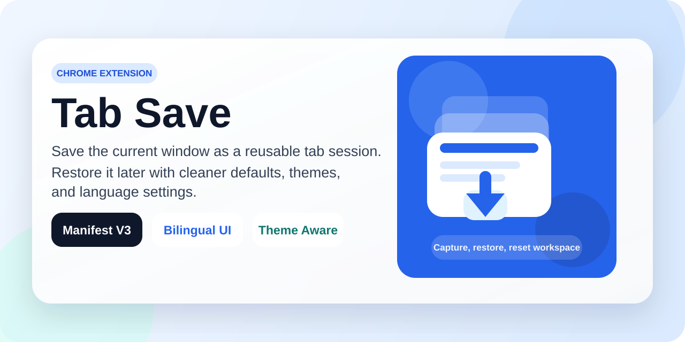
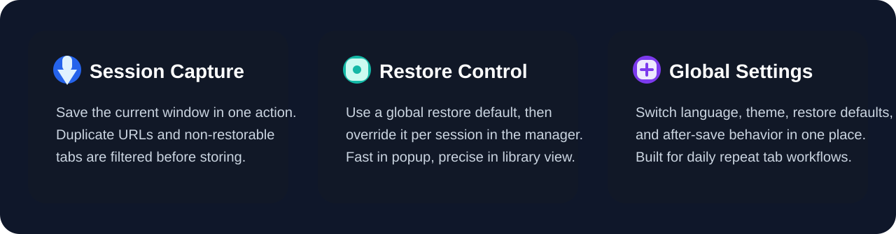

<p align="center">
  
</p>

<h1 align="center">Tab Save</h1>

<p align="center">
  Save the current window as a reusable tab session.
</p>

<p align="center">
  
  
  
  
</p>

<p align="center">
  
</p>

`Tab Save`는 현재 창의 탭 묶음을 세션으로 저장하고, 나중에 다시 복원할 수 있는 Chrome Extension입니다. 팝업에서는 빠르게 저장하고, 관리 페이지에서는 저장한 세션을 정리하고 복원 방식을 세밀하게 조절할 수 있습니다.

## Highlights

- Chrome Extension Manifest V3 기반
- 현재 창 탭을 세션 단위로 저장
- `http/https` 탭만 저장하고 중복 URL 자동 제외
- 팝업에서 바로 복원, 관리 페이지에서 세션별 관리
- 기본 복원 방식, 저장 후 탭 처리, 테마, 언어를 전역 설정으로 제어
- 한국어 / English UI 지원

## Preview

<p align="center">
  
</p>

## Features

### 1. Fast session capture

- 현재 창의 복원 가능한 탭을 한 번에 저장
- 세션 이름 직접 입력 가능
- 저장 후 현재 탭을 유지하거나 모두 닫도록 설정 가능

### 2. Flexible restore flow

- 팝업에서 전역 기본 복원 방식으로 즉시 열기
- 관리 페이지에서 세션별 복원 방식 선택
- `새 탭`
  현재 창에 새 탭들로 복원
- `현재 탭`
  활성 탭을 첫 페이지로 바꾸고 나머지를 옆으로 복원

### 3. Session management

- 저장된 세션 이름 수정
- 세션 삭제 / 실행 취소
- 세션 내부 탭 목록 확인
- 개별 탭 삭제

### 4. Global settings

- 기본 복원 방식
- 저장 후 탭 유지 / 닫기
- 시스템 / 라이트 / 다크 테마
- 한국어 / English 언어 전환

## Tech Stack

- React
- TypeScript
- Vite
- `@crxjs/vite-plugin`
- Vitest

## Install

### Local development

```bash
npm install
```

### Build extension

```bash
npm run build
```

### Run tests

```bash
npm test
```

## Load In Chrome

1. `npm run build`로 `dist/`를 생성합니다.
2. Chrome에서 `chrome://extensions`를 엽니다.
3. 우측 상단에서 `개발자 모드`를 켭니다.
4. `압축해제된 확장 프로그램을 로드합니다`를 클릭합니다.
5. 이 프로젝트의 `dist/` 폴더를 선택합니다.

## Usage

### Save tabs

1. 확장 팝업을 엽니다.
2. 세션 이름을 입력합니다.
3. `저장` 버튼으로 현재 창의 탭을 세션으로 저장합니다.

### Restore tabs

1. 팝업에서 최근 저장 목록을 엽니다.
2. `열기`로 전역 기본 복원 방식에 따라 세션을 복원합니다.
3. 더 세밀한 제어가 필요하면 관리 페이지에서 세션별 복원 방식을 바꿔 복원합니다.

### Manage sessions

1. 관리 페이지를 엽니다.
2. 세션 이름을 수정하거나 삭제합니다.
3. 세션을 펼쳐 포함된 탭 목록을 확인합니다.

## Settings

관리 페이지의 설정 버튼에서 아래 항목을 조정할 수 있습니다.

- 기본 복원 방식
- 저장 후 탭 처리 방식
- 테마
- 언어

## Why Tab Save

- 브라우저 창을 닫기 전에 업무 세션을 빠르게 보관하고 싶을 때
- 프로젝트별 탭 묶음을 반복해서 다시 열어야 할 때
- 현재 창 상태를 유지할지, 저장 후 정리할지 직접 고르고 싶을 때
- 팝업은 빠르게, 관리 페이지는 세밀하게 쓰고 싶을 때

## Permissions

- `tabs`
  현재 창 탭 조회, 복원, 저장 후 탭 닫기 처리에 사용
- `storage`
  세션과 전역 설정을 로컬에 저장

## Project Structure

```text
.
├── manager.html
├── popup.html
├── public
│   └── assets              # extension icons
├── scripts
│   └── generate-icons.mjs  # icon generator
├── src
│   ├── components          # shared UI components
│   ├── lib                 # storage, settings, i18n, restore logic
│   ├── pages               # popup / manager screens
│   ├── test                # vitest tests
│   ├── manager.tsx
│   ├── manifest.ts
│   ├── popup.tsx
│   └── styles.css
├── tasks
│   ├── lessons.md
│   └── todo.md
└── private
    └── screenshots         # local-only reference images, git ignored
```

## Notes

- 세션 데이터는 `chrome.storage.local`에 저장됩니다.
- 다른 기기와 자동 동기화되지는 않습니다.
- `chrome://`, `about:blank` 같은 비표준 URL은 저장 대상에서 제외됩니다.
- 저장용 참고 이미지는 `private/screenshots/`에 두고 Git에는 포함하지 않습니다.

## Development

```bash
npm install
npm test
npm run build
```

아이콘을 다시 생성하려면:

```bash
node scripts/generate-icons.mjs
```

## Current Status

- 빌드 가능
- 테스트 통과
- Manifest V3 대응
- 한국어 / English UI 적용
